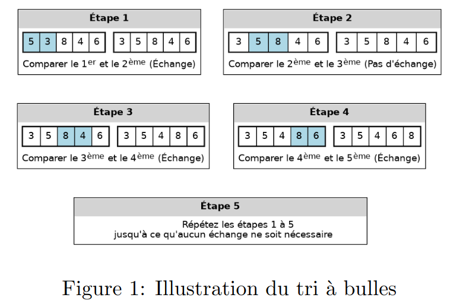
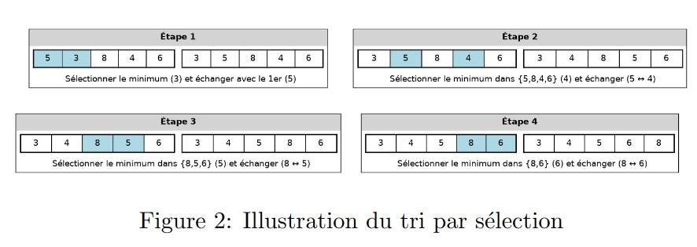
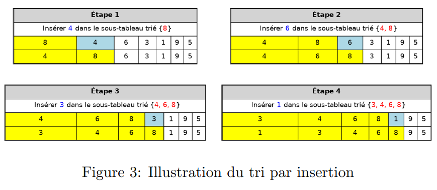
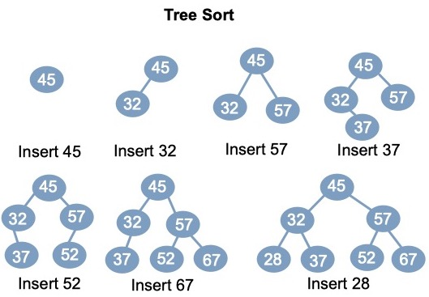

# Best algorithm to sort an array in C

### My goal in this project is to find the fastest and the best sorting algorithm in C, by comparing 4 algorithms.
---
> ## Table of Contents

* [Introduction](#Introduction)
* [Bubble sort](#Bubble-sort)
* [Selection sort](#Selection-sort)
* [Insertion sort](#nsertion-sort)
* [Tree sort](#Tree-sort)

----

## Introduction
In this experiment, I'm using my laptop with the processor Intel® Core™ i5-5300U × 4, and i have changed my stack maximuim memory to more then 200Mo (204800Kb to be exact) so it could stand the largest dataset.

---
## Bubble sort

# 

---

## Selection sort

# 

---

## Insertion sort

# 
---

## Tree sort

 

