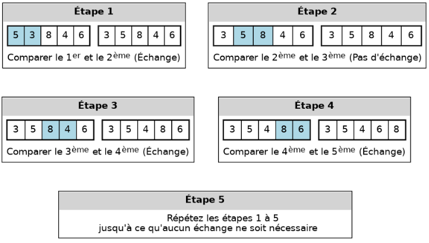
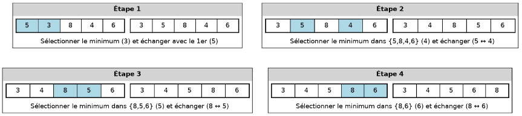
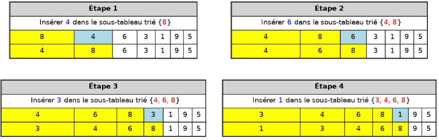
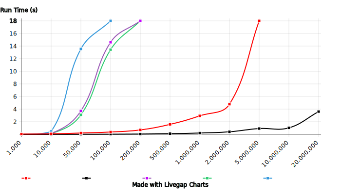

# Best algorithm to sort an array in C

### My goal in this project is to find the fastest and the best sorting algorithm in C, by comparing 4 algorithms.

># Table of Contents

* [Introduction](#Introduction)
* [Bubble sort](#Bubble-sort)
* [Selection sort](#Selection-sort)
* [Insertion sort](#nsertion-sort)
* [Tree sort](#Tree-sort)
* [Analysis and Conclution](#Analysis-and-Conclution)

----

## Introduction
In this experiment, I'm using my laptop with the processor Intel® Core™ i5-5300U × 4, and i have changed my stack maximuim memory to more then 200Mo (204800Kb to be exact) so it could stand the largest dataset.

All test were done with Data generated with a python sript that uses random.randint(), and all the numbers are from -1000 to 1000.

---
## Bubble sort

Bubble sort is a simple sorting algorithm that repeatedly steps through the input list element by element, comparing the current element with the one after it, swapping their values if needed, unil the whole array in sorted, 
and thus it's time complexity in O(n²).

---

## Selection sort

Selection sort is a sorting algorithm that selects the smallest element from an unsorted list in each iteration and places that element at the beginning of the unsorted list,
and it's time complexity is also O(n²).

 

---

## Insertion sort

Insertion sort is a sorting algorithm that places an unsorted element at its suitable place in each iteration and it's time complexity is O(n²).

 
---

## Tree sort

 

What happens here is: 

1- first  we generate the root of the tree, and it's the average number of the tree and it doesn't even have to be an element of the tree, 

2- Then take the unsorted array, we create a tree from it,each node has 2 variable: 

    The key(number we took from the array).

    Iteration(iteration of the number).

and 3 pointers: 

    pointer to the parent.
    
    pointer to the left son.
    
    pointer to the right son.

after that, in the last function we pick the numbers from the tree into a sorted array, with each number we pick we delete the node.

And the final time complexity is O(n).

---
## Analysis and Conclution
 

By comapring all the 4 algorithms, plus the sort function in python, i found out that:

+ The Bubble algorithm is great on small number of numbers, up to 10K numbers, then it skyrocketed.

+ the Selection and the Insertion algorithms have similar run time, even though the algorithms have different logic, the performance was great up to 50K numbers.

+ The Python .sort() performed quite fine in small numbers up to 2M then it suddenly crashed.

+ The Tree algorithm has the best performance so far, as it was the fastest on all the test, with 3.610s run time on a 20M numbers.

#### In the end, The Tree algorithm is the only one stands all tests, and to this point the fastest in all cases.

---

